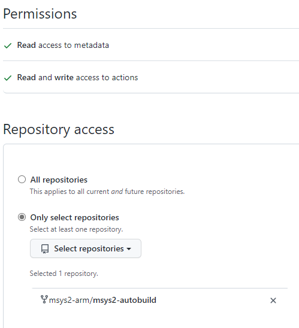

# MSYS2 Autobuild Controller

Get it running:

* copy `application.cfg.sample` to `instance/application.cfg`
* fill out `instance/application.cfg`

```console
poetry install
poetry run flask --app flask_app run
```

## GitHub App Registration

* Organization > Developer Settings > GitHub Apps > New GitHub App
* Fill out "GitHub App name" and "Homepage URL"
* "Callback URL": `https://thisismyapp.example.org/github-callback`
* "Webhook URL": `https://thisismyapp.example.org/github-webhook`
* Fill out "Webhook secret"
* Repository permissions:
  * Metadata: `Read-Only`
  * Actions: `Read and write`

## GitHub App Installation


